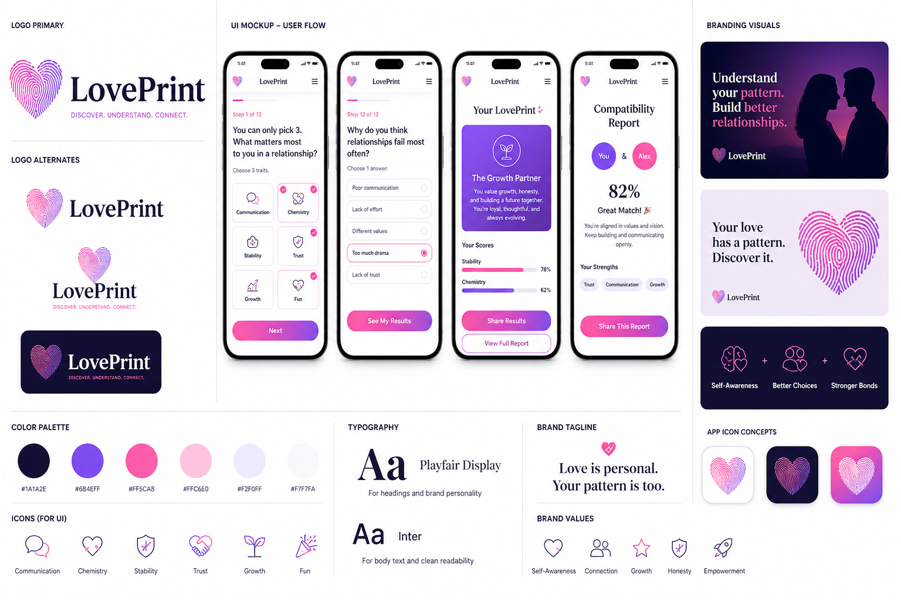

# LovePrint

AI-powered relationship archetype and compatibility platform.

---

## 🎨 Brand Preview

---

## 💡 What is LovePrint?

LovePrint helps people understand:
- Their relationship archetype
- What they prioritize in partners
- Why their relationships succeed or fail
- How compatible they are with others

---

## 🚀 Core Features

- 🔹 Archetype detection (Builder, Chemistry Chaser, Growth Partner, etc.)
- 🔹 Attraction bias scoring (Stability vs Chemistry)
- 🔹 Serious + Funny result modes
- 🔹 Compatibility reports for couples
- 🔹 Shareable insights

---

## 🧠 How It Works

1. Take a short quiz
2. Get your LovePrint
3. Share with a partner
4. Compare compatibility

---

## 📁 Project Structure

- `/docs` → logic, archetypes, scoring  
- `/marketing` → launch plan + content  
- `/design` → branding + UI mockups  

---

## 🚧 Status

MVP in development

---

## 🔥 Vision

Build a viral, mobile-first relationship platform powered by AI and shareability.
